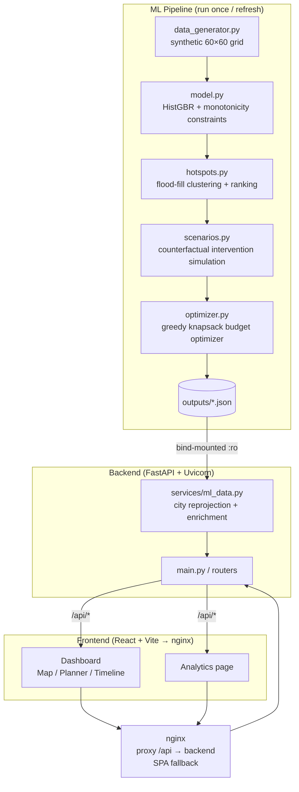

# AI-Powered Urban Heat Intelligence and Mitigation Platform

**Team:** VISION LEAGUE &nbsp;·&nbsp; **Domain:** AI-Driven Urban Heat Mitigation &nbsp;·&nbsp; **Hackathon:** HackMatrix

---

## The Problem

Cities are getting hotter. Rapid urbanization and climate change intensify the Urban Heat Island (UHI) effect, creating localized heat stress zones that put millions of people at risk.

The real gap is not detection — it's decision-making. Urban heat data is fragmented across satellite, weather, GIS, and demographic sources, and existing tools rarely connect the dots:

- **Fragmented data** — satellite, weather, GIS, and demographic data are rarely unified
- **Detection ≠ action** — knowing *where* it's hot does not tell authorities *who is vulnerable*, *what to do*, or *which areas to prioritize*
- **Delayed response** — manual planning workflows slow down intervention decisions

The platform answers one central question: **who is at risk, what can be done, and what should be prioritized first?**

---

## Solution

**THERMA** is a full-stack urban heat intelligence platform that combines a physics-informed ML model, a REST API, and an interactive planning dashboard into a single decision-support workflow.

```
Urban Data → AI/ML Analysis → Risk Zones → Vulnerability → Intervention Recommendations → Prioritized Action
```

The platform moves city planners from a fragmented, manual workflow to an integrated, evidence-based one.

---

## Links

| Resource | Link |
|---|---|
| PPT / Presentation | [Google Drive](https://drive.google.com/drive/folders/1s83Nzx71qhdkqO9qVcY174lohAPegdSa?usp=sharing) |
| Demo Video | [Google Drive](https://drive.google.com/drive/folders/1s83Nzx71qhdkqO9qVcY174lohAPegdSa?usp=sharing) |
| Live Deployment | Not deployed — run locally using Docker (see setup below) |

---

## Team — VISION LEAGUE

| Name | Role |
|---|---|
| **Nikita Tripathi** | Project Lead & AI/ML — problem definition, urban heat intelligence, ML pipeline |
| **Arihant Sharma** | Full-Stack / Backend — backend APIs, system integration, Dockerized deployment |
| **Anmol Choudhary** | Frontend / UX — dashboard experience, data visualization, user interaction |
| **Arushi Dixit** | Visualization & Data — data intelligence, heat-risk modelling, visualization |

---

## What is Built

### ML Pipeline (`AI/urban-heat-aiml/`)

A physics-informed machine learning pipeline that generates a synthetic but physically-plausible 60×60 geospatial grid (representing a ~36 km² urban area), trains a model to predict Land Surface Temperature, detects heat hotspots, and runs counterfactual intervention simulations.

**Model:** `sklearn.ensemble.HistGradientBoostingRegressor` with monotonicity constraints encoding known urban climate physics:

| Feature | Physical constraint |
|---|---|
| Impervious surface fraction | + (hotter with more concrete) |
| NDVI (vegetation index) | − (cooler with more vegetation) |
| Albedo (reflectivity) | − (cooler with higher reflectivity) |
| Sky view factor | − (canyon heat trapping) |
| Building height | + (heat trap) |
| Proximity to water | − (evaporative cooling) |
| Air temperature | + (background climate) |

**Actual model performance on held-out test set:**
- MAE: **0.729°C**
- R²: **0.974**

The pipeline then runs five cooling intervention scenarios (urban greening, cool roofs, green roofs, reflective pavement, street tree canopy) as counterfactual predictions through the trained model, and a greedy knapsack optimizer selects the highest-value interventions subject to a budget constraint.

**Scenario effectiveness on top hotspot zone:**

| Intervention | Mean cooling |
|---|---|
| Urban Greening | −3.47°C |
| Green Roofs | −1.05°C |
| Street Tree Canopy | −0.72°C |
| Cool / High-Albedo Roofs | −0.50°C |
| Reflective Pavement | 0.00°C (no road cells in zone) |

Outputs are written as JSON files to `AI/urban-heat-aiml/outputs/` and read by the backend at runtime.

> **Note on PPT technology claims:** The PPT references XGBoost, SHAP, GeoPandas, and Google Earth Engine. The actual implementation uses `HistGradientBoostingRegressor` (scikit-learn) with permutation importance instead of SHAP, and a synthetic data generator instead of live GEE/GeoPandas pipelines. These are planned extensions, not current implementation.

### Backend (`backend/`)

FastAPI application serving the ML pipeline outputs via a REST API. The backend re-projects ML hotspot centroids into each city's geographic bounding box, enriches every hotspot with intervention recommendations, and exposes a live greedy optimizer endpoint.

**Supported cities:** Delhi, Mumbai, Bangalore, Chennai, Hyderabad

**API endpoints:**

| Method | Endpoint | Description |
|---|---|---|
| GET | `/api/cities` | List of supported cities |
| GET | `/api/cities/{city}/config` | Map center, zoom, bounding box |
| GET | `/api/cities/{city}/hotspots` | Enriched hotspot list |
| GET | `/api/cities/{city}/stats` | Aggregate city statistics |
| GET | `/api/scenarios` | 5 cooling scenario effectiveness data |
| GET | `/api/optimization` | Pre-computed optimizer result |
| POST | `/api/optimization/run` | Live greedy budget optimizer |
| GET | `/api/model-metrics` | Model MAE, R², feature list |
| GET | `/api/interventions/catalogue` | 8 intervention types with specs |
| GET | `/api/interventions/plan/{city}` | Per-zone plan, budget allocation, Gantt phases, cost-impact curve |
| GET | `/api/health` | Health check |

Interactive Swagger docs: `http://localhost:3000/api/docs`

### Frontend (`frontend/`)

React 19 + Vite 8 single-page application served by nginx. Communicates with the backend via relative `/api/` requests — nginx proxies to the backend in production, Vite's dev proxy handles it locally.

**Dashboard views:**

- **Map** — Leaflet dark-tile map with colour-coded hotspot circles (extreme / high / moderate / safe). Click any zone to select it.
- **Planner** — Per-zone intervention plan. Each card shows what to build, where, cost in ₹Crore, implementation timeline, predicted cooling, people protected, and co-benefits.
- **Timeline** — 18-month Gantt-style rollout plan split into three phases: quick wins (0–3 months), medium-term (3–9 months), long-term infrastructure (9–18 months).

**Other panels:**

- **Navbar** — Live stats (zones mapped, critical zones, people at risk, average temperature) with city switcher and navigation to Analytics and Catalogue
- **Sidebar** — Layer toggles, risk-level filters, zone search, statistics charts (risk distribution, temperature breakdown), hour-of-day heat timeline slider
- **Diagnostics** — Overview tab (temperature, risk score, population, recommendations) and Deep Dive tab (dominant heat driver, land-use breakdown pie, metadata, cost-ranked action steps)
- **Bottom panel** — Budget slider (₹0–50M) with three tabs: Projected Outcomes, Budget Allocation (pie chart + priority spend list), Cost vs Impact curve
- **Intervention Catalogue** — Modal showing all 8 intervention types with cooling effectiveness bars, co-benefits, cost ranges, and risk-level suitability
- **Analytics page** — ML model performance metrics, interactive horizontal bar chart for scenario comparison with toggle chips and "Top N" budget filter, full data table
- **Export PDF** — 3-page jsPDF planning report: executive summary with projected outcomes, top-5 priority zones with intervention details, budget allocation breakdown

---

## Architecture



---

## Technology Stack

| Layer | Technology | Notes |
|---|---|---|
| Frontend | React 19, Vite 8, CSS Modules | Leaflet for maps, Recharts for charts, jsPDF for reports |
| Backend | Python 3.12, FastAPI 0.115, Uvicorn 0.32, Pydantic v2 | |
| ML pipeline | Python, scikit-learn 1.4+, pandas 2+, numpy, matplotlib | HistGradientBoostingRegressor with monotonicity constraints |
| Infra | Docker, Docker Compose, nginx 1.27 | Frontend at :3000, backend internal at :8000 |
| **Planned (PPT)** | XGBoost, SHAP, GeoPandas, Google Earth Engine | Not in current implementation |

---

## Project Structure

```text
HackMatrixV2/
├── AI/
│   └── urban-heat-aiml/
│       ├── src/
│       │   ├── run_pipeline.py       end-to-end pipeline entry point
│       │   ├── data_generator.py     synthetic 60×60 geospatial grid
│       │   ├── model.py              physics-informed HistGBR LST model
│       │   ├── hotspots.py           flood-fill hotspot detection + ranking
│       │   ├── scenarios.py          counterfactual intervention simulation
│       │   └── optimizer.py          greedy knapsack budget optimizer
│       ├── outputs/                  JSON files consumed by the backend
│       │   ├── hotspots.json
│       │   ├── scenario_comparison.json
│       │   ├── optimization_result.json
│       │   └── model_metrics.json
│       └── requirements.txt
│
├── backend/
│   ├── main.py                       FastAPI app + CORS
│   ├── config.py                     ML_OUTPUTS_DIR env var
│   ├── requirements.txt
│   ├── Dockerfile
│   ├── .env.example
│   ├── routers/
│   │   ├── cities.py
│   │   ├── interventions.py
│   │   ├── optimization.py
│   │   ├── scenarios.py
│   │   └── metrics.py
│   └── services/
│       └── ml_data.py                all data logic, city projection, optimizer
│
├── frontend/
│   ├── src/
│   │   ├── pages/
│   │   │   ├── Dashboard.jsx         main layout (map / planner / timeline tabs)
│   │   │   └── Analytics.jsx         model metrics + scenario comparison
│   │   ├── components/               Navbar, Sidebar, MapPanel, Diagnostics,
│   │   │                             BottomPanel, InterventionPlanner,
│   │   │                             PlannerTimeline, InterventionCatalogue,
│   │   │                             StatisticsCharts, HeatTimeline, Toast, ...
│   │   ├── hooks/                    useHotspots, useCityStats, useOptimization,
│   │   │                             useSimulation, useHeatTimeline, useCities, ...
│   │   ├── utils/
│   │   │   ├── api.js                all fetch calls
│   │   │   ├── exportReport.js       3-page jsPDF report generator
│   │   │   ├── formatters.js
│   │   │   └── recommendations.js
│   │   └── styles/global.css         design tokens + CSS variables
│   ├── nginx.conf                    proxy /api → backend, SPA fallback
│   ├── vite.config.js                dev proxy /api → localhost:8000
│   ├── Dockerfile
│   └── package.json
│
├── docker-compose.yml
└── README.md
```

---

## Setup

### Prerequisites

- Docker and Docker Compose (recommended)
- Or: Node.js 20+, Python 3.10+

### Docker (recommended — one command)

```bash
git clone https://github.com/nikitatripathi10/AI-Powered-Urban-Heat-Intelligence-and-Mitigation-System
cd AI-Powered-Urban-Heat-Intelligence-and-Mitigation-System
docker compose up --build
```

| Service | URL |
|---|---|
| Dashboard | http://localhost:3000 |
| API docs (Swagger) | http://localhost:3000/api/docs |

The ML pipeline outputs are already committed to the repository under `AI/urban-heat-aiml/outputs/`. The backend reads them at startup via a bind-mounted Docker volume — no additional setup required.

### Local Development (without Docker)

**Backend:**

```bash
cd backend
pip install -r requirements.txt

# Optional: set the ML outputs path if running from a different directory
cp .env.example .env

uvicorn main:app --reload --port 8000
# API available at http://localhost:8000
# Swagger docs at http://localhost:8000/docs
```

**Frontend:**

```bash
cd frontend
npm install
npm run dev
# Dashboard at http://localhost:5173
# Vite proxies /api/* to http://localhost:8000 automatically
```

**Environment variables:**

The only configurable variable is `ML_OUTPUTS_DIR` in `backend/.env`:

```
ML_OUTPUTS_DIR=../AI/urban-heat-aiml/outputs
```

Leave it as-is for the default layout. Override it if you run the backend from a different working directory or in a custom Docker setup.

No API keys, database, or external services are required.

### Refresh ML outputs

To re-run the full pipeline and regenerate all JSON outputs:

```bash
cd AI/urban-heat-aiml
pip install -r requirements.txt
python src/run_pipeline.py
# Outputs written to AI/urban-heat-aiml/outputs/
# Restart the backend (or docker compose restart backend) to pick up new data
```

---

## How it Works

### 1. Data generation

`data_generator.py` generates a synthetic 60×60 grid (~36 km²) with physically-calibrated urban features: LULC classes (built-up, road, tree, grass, water, bare soil), NDVI, albedo, building height and density, sky view factor, impervious fraction, and meteorological variables. The synthetic data is intentionally designed to reproduce the physical relationships the model must learn — it stands in for a real remote-sensing stack (Landsat LST, Sentinel-2 LULC, ERA5 meteorology, OSM morphology).

### 2. Physics-informed model

`model.py` trains a `HistGradientBoostingRegressor` with monotonicity constraints that enforce known urban climate physics (e.g., LST must increase with impervious fraction, decrease with NDVI). This prevents the model from learning spurious relationships and makes counterfactual scenario predictions physically valid.

### 3. Hotspot detection

`hotspots.py` computes a Heat Stress Index (z-score of LST), thresholds at 1 standard deviation above the city mean, then uses flood-fill connected-component labeling to cluster contiguous hot cells into named hotspot zones ranked by severity (intensity × spatial extent).

### 4. Intervention simulation

`scenarios.py` simulates five cooling interventions by perturbing the physical feature grid (e.g., urban greening raises NDVI and lowers impervious fraction) and re-running the trained model to predict the resulting LST change. Because the model has monotonicity constraints, these counterfactual predictions are physically consistent.

### 5. Budget optimization

`optimizer.py` enumerates all (cell, intervention) pairs in the hotspot footprint, scores each by predicted cooling per cost unit, and greedily selects the highest-value combinations until the budget is exhausted — a standard approximation of the multi-choice knapsack problem.

### 6. API layer

The FastAPI backend reads the pipeline outputs, reprojects hotspot centroids from the synthetic grid into each of the five Indian cities' geographic bounds (deterministically seeded per city), enriches every hotspot with intervention metadata, and exposes the optimization endpoint for live budget-constrained runs from the frontend.

### 7. Dashboard

The React frontend fetches city hotspots and configuration in parallel on city change, derives aggregate stats locally, and renders the map, planner, timeline, diagnostics, and analytics views. The budget slider triggers a debounced re-fetch of the intervention plan from the backend.

---

## Feasibility and Impact

**Technical:** The stack (React, FastAPI, scikit-learn, Docker) is mature and the architecture is modular. Each component — data ingestion, model, API, frontend — can be upgraded independently.

**Operational:** The platform is web-based with no client-side installation. Adding a new city requires only a configuration entry and a dataset. Adding a new intervention requires updating the catalogue and scenarios module.

**Beneficiaries:** Municipal authorities, urban planners, public health officials, and ultimately the residents of heat-stressed urban zones.

**Impact pathway:** Heat-risk visibility → evidence-based prioritization → faster, more targeted interventions → reduced heat exposure for vulnerable communities.

---

## Roadmap

### Now — Hackathon prototype (built)

- Physics-informed ML model with monotonicity constraints
- Full hotspot detection, scenario simulation, and budget optimization pipeline
- FastAPI backend with 11 endpoints
- React dashboard with map, intervention planner, timeline, analytics, and PDF export
- Dockerized single-command deployment
- 5 Indian cities supported

### Next — MVP improvement (planned)

- Replace synthetic data generator with real Landsat 8 / ECOSTRESS LST via Google Earth Engine
- Add GeoPandas + OpenStreetMap for real building footprints and road networks
- Replace permutation importance with SHAP-based driver explanations
- Expand model validation with held-out real-world data
- User testing with urban planning practitioners
- Security hardening for multi-tenant use

### Later — Pilot (planned)

- Pilot deployment with a selected Indian municipality
- Integrate live/periodic environmental datasets (CPCB, IMD, ERA5)
- Real-world intervention outcome tracking
- Feedback-driven model refinement

### Scale (planned)

- Multi-city comparative analytics
- Additional countries and climate zones
- More intervention types and co-benefit tracking
- City-to-city benchmarking

---

## Known Limitations

- The ML pipeline currently runs on **synthetic data**. Model performance metrics (MAE 0.729°C, R² 0.974) are on held-out synthetic data, not validated against real remote-sensing observations.
- The five Indian city hotspot maps are generated by **re-projecting synthetic centroids** into city bounding boxes with deterministic seeding — they do not reflect actual measured LST for those cities.
- XGBoost, SHAP, GeoPandas, and Google Earth Engine are referenced in the project presentation as intended technologies but are not implemented in this prototype.

---

*Built at HackMatrix by VISION LEAGUE.*
